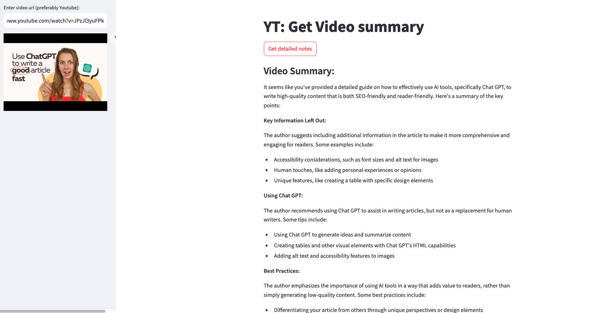

## Youtube Videos summary Generator

This is a simple video summary generation application.
This will take youtube URL as input, gets the transcript using Youtube APIs and then generate summary of the video.

For now using OLLAMA to host local models and get the summary.

## Demo 
Output of this looks like as: 

